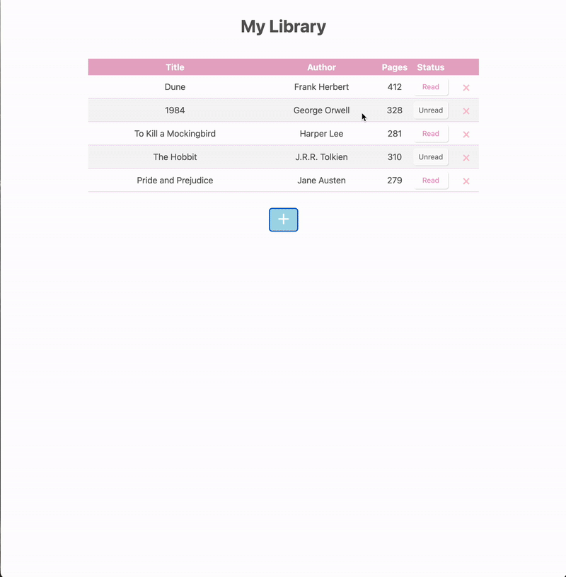

# 📚 Library App  

A small library management app built as part of [The Odin Project](https://www.theodinproject.com/) JavaScript curriculum.  
The app is made with **Vanilla JavaScript**, focusing on object constructors, DOM manipulation, and event handling.  

---

## Features  
- **Add a book** using a dialog modal form (title, author, pages, read status).  
- **Toggle read status** of a book (switch between *Read* and *Unread*).  
-  **Remove a book** from the library.  
-  **Display all books** in a table with dynamic rendering.  
-  Built with **Object Constructor** pattern (Book objects stored in an array).  

---

## Technologies Used  
- HTML5  
- CSS3  
- Vanilla JavaScript (no frameworks)  

---

## Learning Goals
This project demonstrates:
- Creating and working with object constructors and arrays to store data
- DOM manipulation
- Using event delegation for dynamic elements (delete / toggle read)
- Handling forms with FormData and dialog modals

---

## Demo
